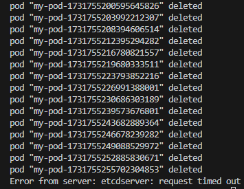
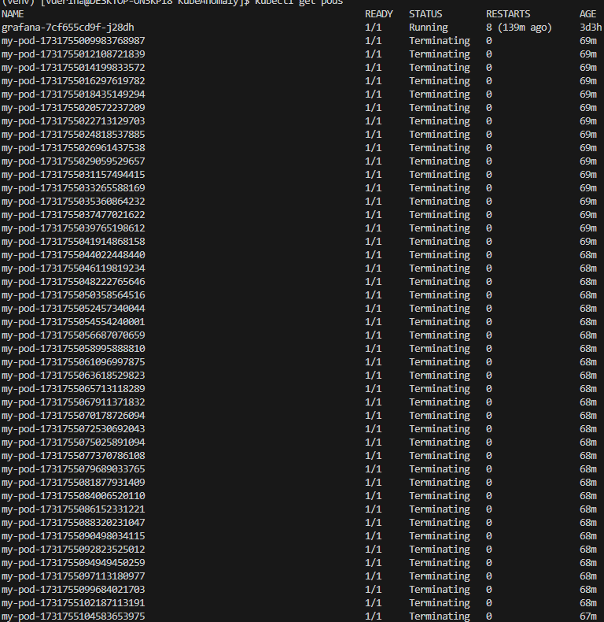
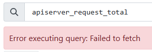
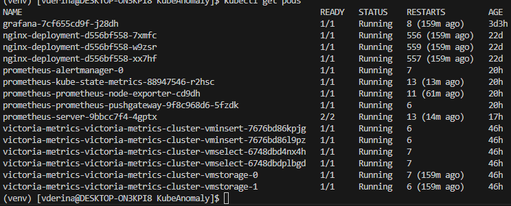
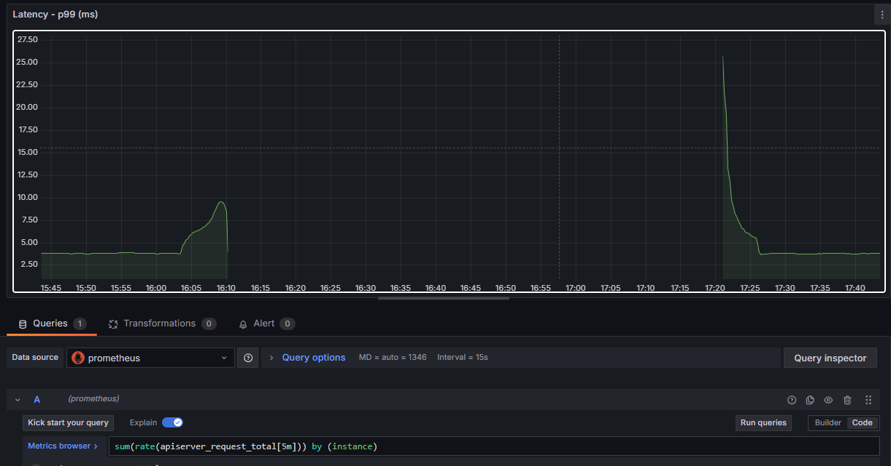
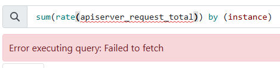
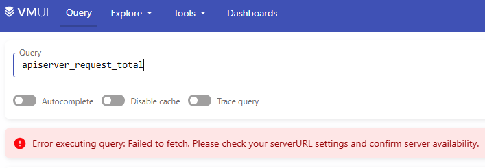

# Моделируем поломку

Скрипт по развертыванию подов с интервалом в 2 секунды:
```bash

```
Скрипт по удалению подов:
```bash

```
# Postmortem
1. Скрипт был запущен в 16:03, остановлен ~16:07. Было создано 90 подов. Нагрузка на api сервер росла (см. фото ниже), но кластер работал, все поды были в статусе Running.

1. На этапе удаления всех подов получили ошибку: **"Error from server: etcdserver: request timed out".**               



1. Запустили скрипт повторно, и поды продолжили удаляться. Нагрузка на api сервер росла (см. фото выше).

2. После удаления поды перешли в статус *Terminating*:


1. Запрос `kubectl get pods` очень долго выполнялся и периодически выдавал ошибки:

    - Error from server (Timeout): the server was unable to return a response in the time allotted, but may still be processing the request (get pods)
    - Unable to connect to the server: net/http: TLS handshake timeout

2. Prometheus выдавал ошибку:** "Error executing query: Failed to fetch"**.      


1. Victoria Metrics выдавала ошибку: **"ERROR: 503, error occured during search: cannot fetch query results from vmstorage nodes: cannot perform search on vmstorage victoria-metrics-victoria-metrics-cluster-vmstorage-1.victoria-metrics-victoria-metrics-cluster-vmstorage.default.svc.cluster.local.:8401: cannot obtain connection from a pool: cannot dial victoria-metrics-victoria-metrics-cluster-vmstorage-1.victoria-metrics-victoria-metrics-cluster-vmstorage.default.svc.cluster.local.:8401: dial tcp4: lookup victoria-metrics-victoria-metrics-cluster-vmstorage-1.victoria-metrics-victoria-metrics-cluster-vmstorage.default.svc.cluster.local. on 10.96.0.10:53: read udp 10.244.0.247:37372->10.96.0.10:53: read: connection refused"**.


1. UI Grafana упал.

*Спустя 1 час 20 минут*

1.  Все поды удалились.

1.  Перезапустили port-forwarding для Grafana. Стали отображаться метрики. Но на момент поломки кластера с 16:10 до 17:20 метрики отсутствуют.


1.  Victoria Metrics выдает новую ошибку: **"Error executing query: Failed to fetch"**.       

1.  Prometheus выдает новую ошибку: **"Error executing query: Failed to fetch. Please check your serverURL settings and confirm server availability."**  
