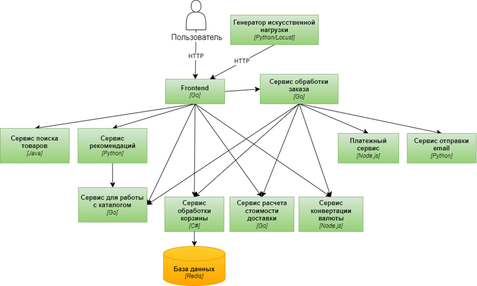

В проекте было использовано демонстрационное приложение ["E-commerce"](https://github.com/GoogleCloudPlatform/microservices-demo).

## Протокол взаимодействия

Микросервисы общаются друг с другом с помощью gRPC (Remote Procedure Call), который позволяет сервисам вызывать методы друг друга как обычные функции.

Контракт .proto описан в файле.

## Frontend

Зависимые сервисы:

- Сервис обработки заказов

Сервис обрабатывает различные эндпоинты, такие как:

/ — главная страница.

/product/{id} — информация о продукте.

/cart — управление корзиной (просмотр, добавление товаров, очистка).

/setCurrency — установка валюты.

/checkout — оформление заказа.

/assistant — взаимодействие с помощником по покупкам.

/static/ — обслуживание статических файлов (CSS, JS, изображения).

/robots.txt — файл для роботов поисковых систем.

/_healthz — эндпоинт для проверки здоровья сервиса.

/product-meta/{ids} — получение метаданных о продуктах.

/bot — обработка запросов от чат-бота.