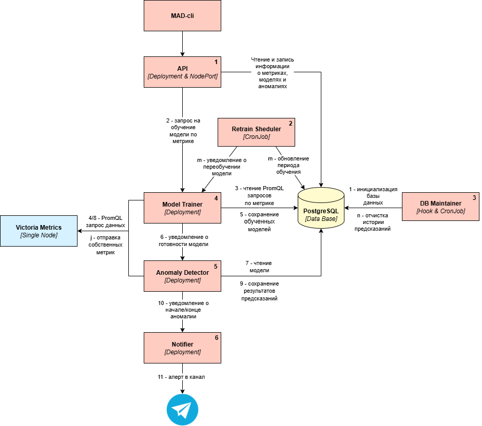
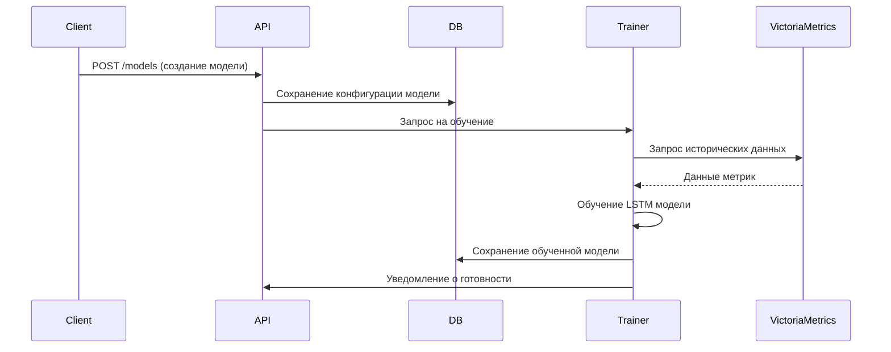
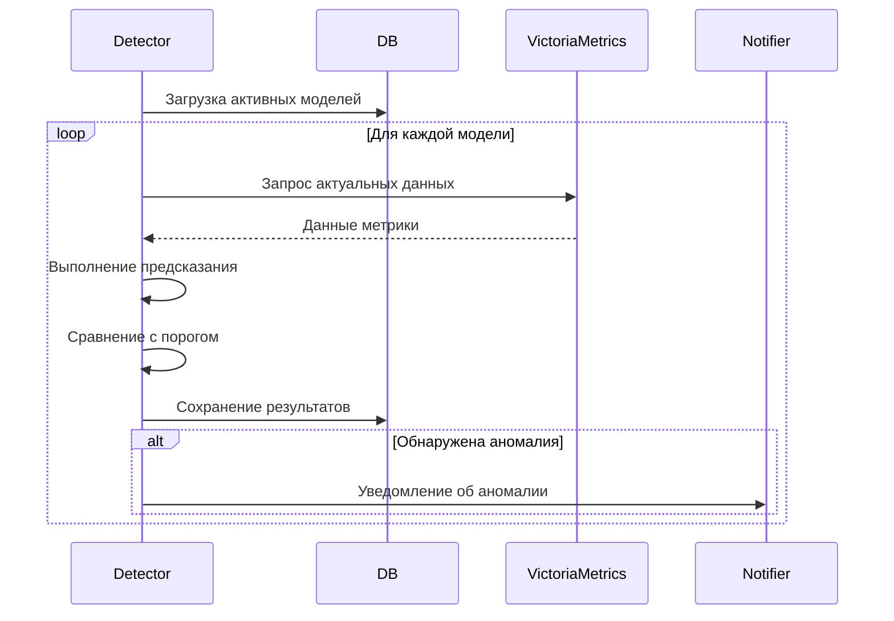
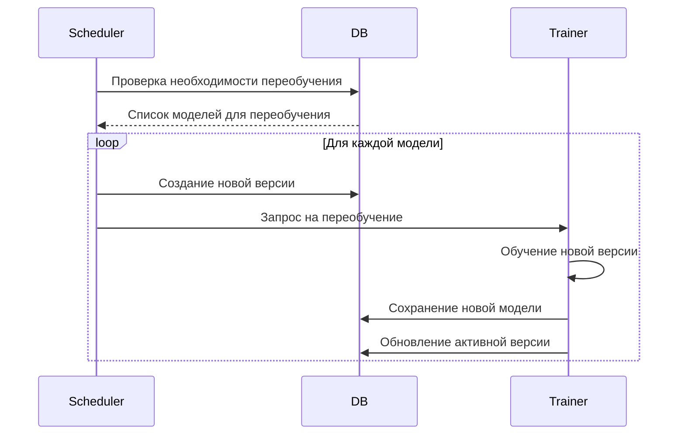

Система состоит из нескольких микросервисов, которые взаимодействуют друг с другом через API и сообщения. Состояние системы и данные хранятся в PostgreSQL.

## Архитектура системы MAD
{ width="1000" }

## Компоненты системы

### 1. API
**Роль:** Основной REST API шлюз для управления системой.

**Основные функции:**

-  Предоставляет CRUD API для управления моделями, метриками и аномалиями

-  Принимает запросы на обучение и переобучение моделей

-  Валидирует входные данные и управляет состоянием системы

-  Интегрируется с сервисом обучения моделей

---

### 2. Retrain Scheduler
**Роль:** Планировщик переобучения моделей.

**Основные функции:**

-  Проверка необходимости переобучения моделей

-  Управление версиями моделей

-  Поддержка разных стратегий переобучения:
  
-  Скользящее окно (sliding_window)
  
-  Расширяющееся окно (expanding_window)

-  Интеграция с сервисом обучения
  
---

### 3. DB Maintainer
**Роль:** Утилита управления структурой базы данных.

**Основные функции:**

-  Инициализация схемы БД

-  Управление конфигурацией метрик и моделей

-  Очистка старых версий моделей

-  Миграции данных

---
### 4. Model Trainer
**Роль:** Сервис обучения и оптимизации ML моделей.

**Основные функции:**

-  Обучение новых LSTM моделей на исторических данных

-  Автоматическая оптимизация гиперпараметров через Optuna

-  Переобучение существующих моделей по расписанию

-  Валидация качества моделей

-  Сохранение обученных моделей в базу данных

**Процесс обучения:**
1. Получение исторических данных из VictoriaMetrics

2. Предобработка данных (интерполяция, масштабирование)

3. Оптимизация гиперпараметров (если включено)

4. Обучение LSTM сети

5. Валидация и сохранение модели

---

### 5. Anomaly Detection

**Роль:** Ядро системы - анализ метрик в реальном времени и обнаружение аномалий.

**Основные функции:**

-  Загружает активные модели из базы данных

-  Получает данные метрик из VictoriaMetrics

-  Выполняет предсказания с использованием LSTM моделей

-  Обнаруживает аномалии на основе пороговых значений

-  Управляет жизненным циклом аномалий (начало/окончание)

-  Интегрируется с сервисом уведомлений

**Алгоритм работы:**
1. Загрузка актуальных моделей из кэша или БД

2. Получение данных метрик за временное окно

3. Масштабирование данных и выполнение предсказаний

4. Расчет ошибок предсказания и сравнение с порогом

5. Классификация аномалий (точечные, групповые, системные)

6. Сохранение результатов в БД

---

### 6. Anomaly Notifier
**Роль:** Сервис управления уведомлениями об аномалиях.

**Основные функции:**

-  Прием событий об аномалиях от детектора

-  Форматирование сообщений с использованием Jinja2 шаблонов

-  Отправка уведомлений в Telegram

-  Поддержка разных типов уведомлений (начало/окончание аномалии)

**Формат уведомлений:**

-  Старт аномалии: тип, метрика, время начала, описание

-  Завершение аномалии: длительность, статистика

-  Поддержка Markdown форматирования

---

### 7. PostgreSQL Database
**Роль:** Центральное хранилище данных системы.

**Основные таблицы:**

-  `models_info` - метаинформация о моделях

-  `models` - версии моделей и их параметры

-  `metrics` - конфигурация метрик

-  `prediction_errors` - результаты предсказаний

-  `anomaly_points` - точечные аномалии

-  `anomaly_system` - системные аномалии

---

## Взаимодействие компонентов

### 1. Процесс обучения модели

### 2. Процесс обнаружения аномалий

### 3. Процесс переобучения
