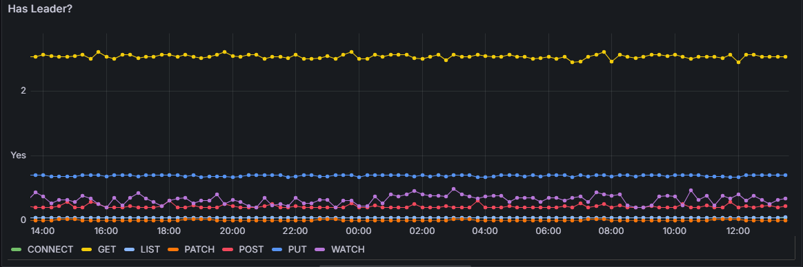
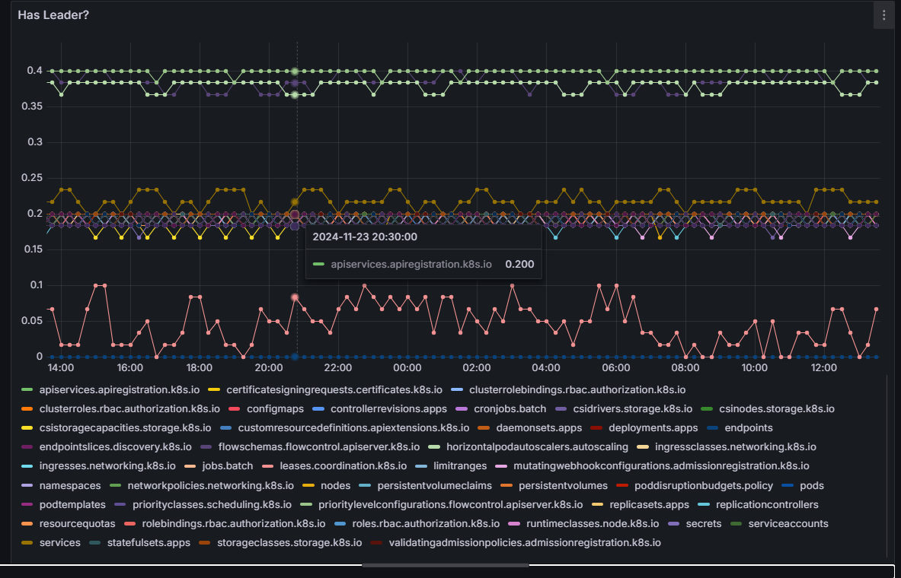
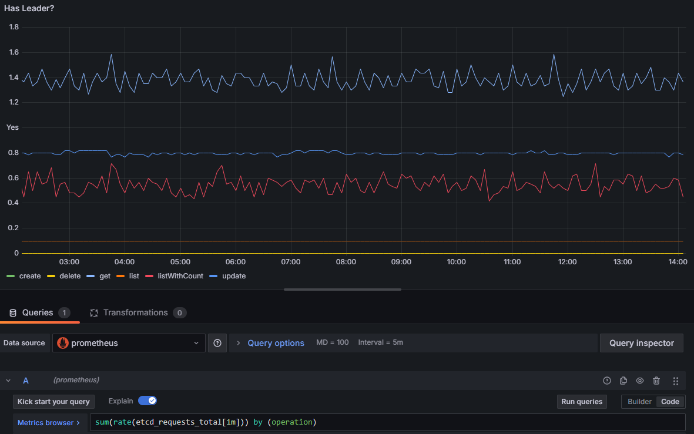
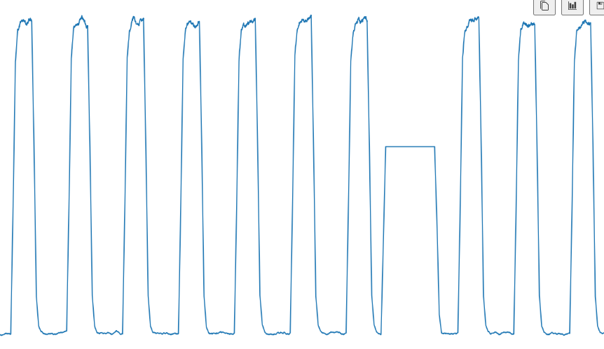
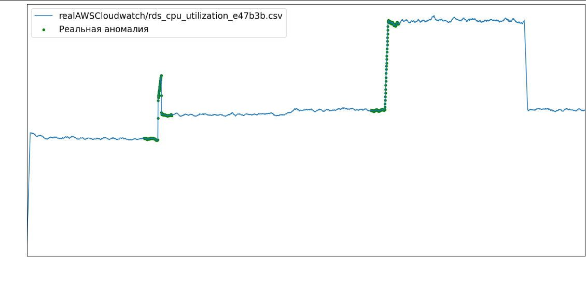
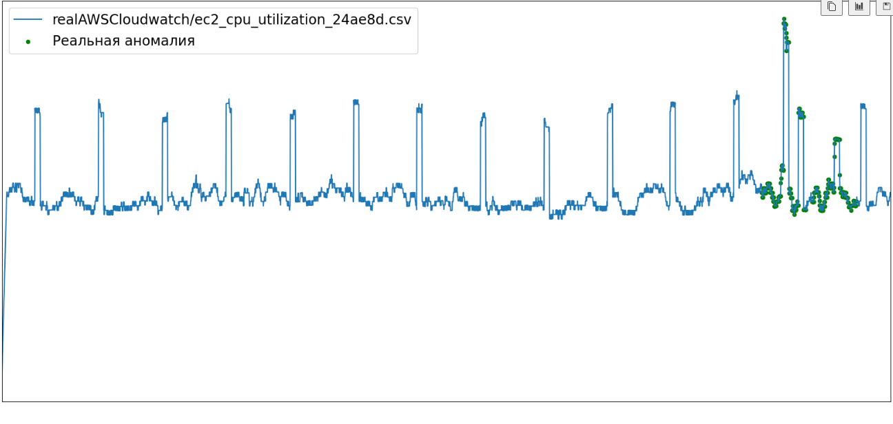

Представим себе ситуацию, когда для среды с микросервисной архитектурой потребовалось настроить систему сбора метрик. Перед DevOps специалистом встают резонные вопросы:

1. Какие метрики должны отслеживаться?

2. На какие метрики настраивать алерты?

3. Как определять момент, в который должен прийти алерт?

Чтобы ответить на эти вопросы, проанализируем и сгруппируем основные виды метрик для среды с микросервисной архитектурой.

## Систематизация основных видов метрик

1. **Метрики, не поддающиеся прогнозу (собираются для общей информации):**

	Необходимость алертинга: -
    
	Способ настройки алертов: -

    Примеры метрик:

      - Uptime (Время работы): Время, в течение которого сервис был доступен. (метрика надежности)
      - Downtime (Время простоя): Время, в течение которого сервис был недоступен. (метрика надежности)
      - MTTR (Mean Time to Repair): Среднее время, необходимое для восстановления работы сервиса после сбоя. (метрика надежности)
      -  MTBF (Mean Time Between Failures): Среднее время между сбоями. (метрика надежности)

5. **Метрики, алерты на которые можно настроить с помощью универсального порогового значения:**

	Необходимость алертинга: +

	Способ настройки правил алертинга: ручной с заданным пороговым значением
   
    Примеры метрик:

      - Error Rate (Частота ошибок): Процент запросов, завершившихся с ошибкой. (метрика производительности)
      - Количество успешных транзакций: Количество успешно выполненных бизнес-операций. (бизнес метрика)
      - Количество отказов: Количество неудачных транзакций. (бизнес метрика)
      - Время отклика, время загрузки страницы. (метрика производительности)

6. **Множественные метрики, которым характерны индивидуальные пороговые значения, человеку самому сложно определить, что есть "норма", и значения порогов следует искать в статистике из прошлого, чтобы детектировать аномалии (=выбросы) в будущем:**

	Необходимость алертинга: +

	Способ настройки правил алертинга: прогнозирование временного ряда с помощью **статистических методов** и срабатывание алерта, если фактическое не совпадает с прогнозируемым

Пояснение: результат запроса с ключевым словом `by` в PromQL может содержать несколько временных рядов, каждая из которых соответствует уникальному набору лейблов. Если настроен алерт в Prometheus с порогом, например, `> 50`, и запрос возвращает несколько значений, то Prometheus будет оценивать каждую временную серию отдельно.

- Prometheus будет применять условие алерта (`> 50`) к каждой временной серии, возвращенной запросом. Если хотя бы одна временная серия превышает порог, алерт сработает.

- Если несколько временных серий превышают порог, алерт может сработать несколько раз. Каждое срабатывание будет соответствовать отдельной временной серии.

Примеры таких метрик:

- Время выполнения бизнес-операций: Время, затраченное на выполнение конкретных бизнес-операций. (бизнес метрика)

- Latency (Задержка): Время, которое требуется для выполнения запроса. (метрика производительности). В микросервисной архитектуре каждый сервис может быть написан на своем языке программирования, обмен данными происходит по разным протоколам и, как следствие, для каждого сервиса своя норма задержки:
  
    	- **HTTP/1.1**: Обычно задержка составляет от 50 до 200 мс для внутренних запросов и от 200 до 500 мс для внешних запросов.
    	- **HTTP/2:** Задержка может быть ниже, чем у HTTP/1.1, благодаря мультиплексированию и другим оптимизациям. Обычно от 30 до 150 мс.
    	- **gRPC:** Задержка может быть еще ниже, чем у HTTP/2, благодаря использованию бинарного формата и более эффективной сериализации. Обычно от 10 до 100 мс.
    	------------------------------------------------------------------------------------
    	- **Java:** Задержка может быть выше из-за JIT-компиляции и GC (сборщика мусора). Обычно от 50 до 200 мс.
    	- **Go:** Задержка обычно ниже благодаря более эффективной работе с памятью и конкурентности. Обычно от 10 до 100 мс.
    	- **Python:** Задержка может быть выше из-за интерпретации и GIL (Global Interpreter Lock). Обычно от 50 до 200 мс.
    	- **Node.js:** Задержка может быть ниже благодаря асинхронной модели выполнения. Обычно от 20 до 150 мс.

Примеры PromQL запросов, отображающие данный тип метрик:

```
sum(rate(apiserver_request_total[1m])) by (verb)
```



```
sum(rate(etcd_requests_total[1m])) by (operation)
```


```
sum(rate(etcd_bookmark_counts[1m])) by (resource)
```



```
sum(rate(etcd_requests_total[1m])) by (operation)
```



---
**4 .** **Одиночные метрики для которых или нет понятия порогового значения, их "норма" может заключаться в сезонности или цикличности, или у них может существовать пороговое значение, нормальное в данном контексте, но при смене конфигурации эта норма так же изменится**
   
Необходимость алертинга: +

Способ настройки правил алертинга: прогнозирование временного ряда с помощью **методов глубокого обучения** и срабатывание алерта, если фактическое не совпадает с прогнозируемым

Это, например, метрика нагрузки на CPU при настроенном VPA в кластере: то есть нагрузка растет и потом, доходя до определенного уровня, развертывается новая нода и нагрузка снова распределяется. Аномалия случается тогда, когда метрика отклоняется от своего привычного поведения
{ align=left }

Что показывают следующие метрики - хз, но суть должна быть такая
{ align=left }
{ align=left }
{ align=left }

### Выводы
Первые две группы метрик без проблем настраиваются вручную.

Третий раздел с метриками требует длительного анализа и четкого понимания, что есть "норма". Чтобы избавить человека от анализа большого объема данных, предлагается воспользоваться статистическими методами прогнозирования и детекции аномалий для данного типа метрик. Характеристика этих метрик: стационарные, несезонные.

Четвертый раздел включает в себя метрики, для которых понятие "нормы" меняется со временем и требует динамического изменения правил алертинга, что невозможно контролировать вручную. Лучше всего с задачей прогнозирования динамических временных рядов и нахождении в них аномалий справляются методы машинного обучения.

## Определение характеристик данных
Предполагается, что большинство метрик системы (третий вид метрик) имеют стационарный, ациклический характер. Докажем это, чтобы обосновать целесообразность использование стат. моделей в будущем для прогнозирования таких временных рядов.

Стационарность временного ряда определяется с определенной точностью, которая зависит от задачи и допустимой ошибки. Абсолютно точной стационарности не требуется, так как реальные данные всегда содержат некоторый уровень шума и вариаций.

**Методы проверки стационарности:**

    1. **Графический анализ:**
        - Построение графика временного ряда и визуальный анализ его поведения.
        - Построение графика автокорреляционной функции (ACF) и частной автокорреляционной функции (PACF).
    2. **Статистические тесты:**
        - **Тест Дики-Фуллера (Dickey-Fuller Test):** Проверяет наличие единичного корня (unit root) в ряде, что указывает на нестационарность.
        - **Тест KPSS (Kwiatkowski-Phillips-Schmidt-Shin Test):** Проверяет стационарность ряда относительно детерминированного тренда.

Определим стационарность для третьего типа данных с помощью тестов Дики-Фуллера и KPSS

Выгружаем метрики из Victoria Metrics:
```
curl -v 'http://localhost:8481/select/0/prometheus/api/v1/query_range' --data-urlencode 'query=sum(rate(etcd_requests_total{operation="get"}[1m]))' -d 'start=-12h' -d 'step=5m' | jq -r '.data.result[].values[] | @csv' > output.csv
```
Добавляем в файл заголовочную строку "timestamp,value"

Запускаем скрипт:
```
import numpy as np
import pandas as pd
from statsmodels.tsa.stattools import adfuller, kpss
import matplotlib.pyplot as plt

# Загрузка данных
data = pd.read_csv('output.csv', index_col='timestamp', parse_dates=True)

# Тест Дики-Фуллера
result_adf = adfuller(data['value'])
print('ADF Statistic:', result_adf[0])
print('p-value:', result_adf[1])
print('Critical Values:', result_adf[4])

# Тест KPSS
result_kpss = kpss(data['value'])
print('KPSS Statistic:', result_kpss[0])
print('p-value:', result_kpss[1])
print('Critical Values:', result_kpss[3])
```

По итогам теста получились следующие результаты:
```
ADF Statistic: -3.89584873962392
p-value: 0.0020656113965745633
Critical Values: {'1%': np.float64(-3.479742586699182), '5%': np.float64(-2.88319822181578), '10%': np.float64(-2.578319684499314)}
```
```
KPSS Statistic: 0.2931810861988101
p-value: 0.1
Critical Values: {'10%': 0.347, '5%': 0.463, '2.5%': 0.574, '1%': 0.739}
```
### Интерпретация результатов
Значение статистики KPSS (0.2931810861988101) меньше всех критических значений (0.347, 0.463, 0.574, 0.739). Это означает, что ряд может быть стационарным на всех уровнях значимости (10%, 5%, 2.5%, 1%).

p-value равно 0.1, что больше стандартного уровня значимости 0.05. Это означает, что у нас нет достаточных оснований отвергнуть нулевую гипотезу о стационарности ряда.
Результаты теста KPSS указывают на то, что временной ряд может быть стационарным. 

Значение статистики KPSS меньше всех критических значений, а p-value больше стандартного уровня значимости 0.05. Это позволяет сделать вывод о том, что ряд стационарен.
## Стат. методы прогнозирования ВР
1. **AR**
Авторегрессия — это статистический метод, который используется для моделирования взаимосвязи между зависимой переменной (целевой) и одной или несколькими независимыми переменными (предикторами). В контексте прогнозирования временных рядов, регрессия может использоваться для моделирования зависимости будущих значений временного ряда от его прошлых значений и других факторов.
Пример:
- Линейная регрессия: Модель линейной регрессии предполагает, что зависимость между зависимой переменной и предикторами линейна:
yt=β0+β1xt−1+β2xt−2+ϵt
(формулы, формулы, формулы)
Хотя метод регрессии может быть полезен для прогнозирования временных рядов, у него есть несколько недостатков:
Метод регрессии предполагает линейную зависимость между предикторами и целевой переменной. Если зависимость нелинейная, точность прогноза может быть низкой.
Регрессионные модели чувствительны к выбросам, которые могут значительно исказить результаты.
Метод регрессии не учитывает сезонность и тренд в данных. Для учета этих факторов требуется дополнительная обработка данных.
Выбор количества предикторов (лагов) может быть сложным. Слишком много предикторов может привести к переобучению, а слишком мало — к недообучению.
Обновление модели с каждым новым наблюдением может быть вычислительно затратным, особенно для больших наборов данных.

2. **MA**

3. **ARIMA**
- **ARIMA (Авторегрессионная интегрированная модель скользящего среднего):** Модель ARIMA(p, d, q) объединяет авторегрессию, интегрирование и скользящее среднее для моделирования временных рядов.

4. **SARIMA**
- **SARIMA (Сезонная ARIMA):** Модель SARIMA(p, d, q)(P, D, Q)s добавляет сезонные компоненты к модели ARIMA.

5. **Метод экспоненциального сглаживания**
(Exponential Smoothing, ES) — это техника прогнозирования временных рядов, которая присваивает экспоненциально убывающие веса прошлым наблюдениям. Это позволяет модели фокусироваться на последних данных, что особенно полезно для рядов с нестационарностью.
Особенности:
- Экспоненциальное сглаживание присваивает экспоненциально убывающие веса прошлым наблюдениям, что позволяет модели фокусироваться на последних данных.
- ES может быть использовано для рядов без тренда и сезонности (простое экспоненциальное сглаживание), с трендом (двойное экспоненциальное сглаживание) и с трендом и сезонностью (тройное экспоненциальное сглаживание, или Holt-Winters).

6. **Классификационно-регрессионные деревья (CART)**
Метод машинного обучения, который используется для решения задач классификации и регрессии. В контексте прогнозирования временных рядов, CART могут использоваться для прогнозирования будущих значений на основе исторических данных.
**Пример:**
- **Регрессионное дерево:** Дерево решений строится путем разделения данных на подмножества на основе значений предикторов. Каждый лист дерева соответствует прогнозу для данного подмножества.
**Преимущества:**
- Может моделировать нелинейные зависимости.
- Устойчив к выбросам.
**Недостатки:**
- Подвержен переобучению.
- Нестабильность: небольшие изменения в данных могут привести к значительным изменениям в структуре дерева.

7. Генетические алгоритмы (GA) (Evgeniev)
Это метод оптимизации, основанный на принципах естественного отбора и генетики. В контексте прогнозирования временных рядов, GA могут использоваться для оптимизации параметров моделей или для поиска оптимальной структуры модели.
**Пример:**
- **Оптимизация параметров модели:** GA могут использоваться для поиска оптимальных значений параметров модели ARIMA.
**Преимущества:**
- Может находить глобальный оптимум.
- Гибкость: может применяться к широкому классу задач.
**Недостатки:**
- Высокая вычислительная сложность.
- Требует тщательной настройки параметров алгоритма.

8. Опорные векторы (SVM) (Evgeniev)
Это метод машинного обучения, который используется для решения задач классификации и регрессии. В контексте прогнозирования временных рядов, SVM могут использоваться для прогнозирования будущих значений на основе исторических данных.
**Пример:**
- **Регрессия SVM:** Модель SVM строит гиперплоскость, которая минимизирует ошибку прогнозирования.
**Преимущества:**
- Может моделировать нелинейные зависимости с использованием ядерных функций.
- Устойчив к выбросам.
**Недостатки:**
- Высокая вычислительная сложность.
- Требует тщательной настройки параметров  

## Методы глубокого обучения для прогнозирования ВР
## Задача поиска аномалий во временных рядах
Цель: Обнаружить нехарактерные или необычные значения (аномалии) в временном ряду.

Примеры методов:
- Статистические методы: Например, методы на основе Z-оценки, где аномалия определяется как значение, значительно отличающееся от среднего.
- Методы на основе расстояния: Например, метод k-ближайших соседей (k-NN), где аномалия определяется как точка, далекая от своих соседей.
- Методы на основе машинного обучения: Например, использование автоэнкодеров (autoencoders) для обнаружения аномалий, где модель обучается восстанавливать "нормальные" данные, а аномалии — это те данные, которые модель не может восстановить хорошо.
Методы из KAD:
autoencoder


- Производительность. Throughput (Пропускная способность): Количество запросов, обрабатываемых системой в единицу времени.
- Производительность. Saturation (Насыщение): Степень использования ресурсов системы (например, CPU, память, сеть).
- Ресурсы. CPU Usage (Использование CPU): Уровень использования процессорного времени. (+рассмотреть ситуацию с Horisontal Pod Autoscaler)
- Безопасность. Количество попыток входа: Количество попыток аутентификации.
- Ресурсы. Memory Usage (Использование памяти): Объем используемой оперативной памяти.
- Ресурсы. Disk I/O (Ввод/вывод на диск): Скорость чтения/записи на диск.
- Ресурсы. Network I/O (Сетевой ввод/вывод): Скорость передачи данных по сети.